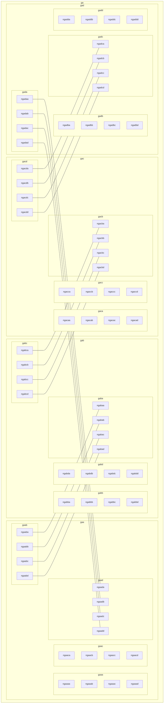

```mermaid
flowchart 

subgraph ga
  subgraph gaa
    subgraph gaaa
      ngaaaa
      ngaaab
      ngaaac
      ngaaad
    end
    subgraph gaab
      ngaaba
      ngaabb
      ngaabc
      ngaabd
    end
    subgraph gaac
      ngaaca
      ngaacb
      ngaacc
      ngaacd
    end
    subgraph gaad
      ngaada
      ngaadb
      ngaadc
      ngaadd
    end
  end
  subgraph gab
    subgraph gaba 
      ngabaa
      ngabab
      ngabac
      ngabad
    end
    subgraph gabb
      ngabba
      ngabbb
      ngabbc
      ngabbd
    end
    subgraph gabc
      ngabca
      ngabcb
      ngabcc
      ngabcd
    end
    subgraph gabd
      ngabda
      ngabdb
      ngabdc
      ngabdd
    end
  end
  subgraph gac
    subgraph gaca
      ngacaa
      ngacab
      ngacac
      ngacad
    end
    subgraph gacb
      ngacba
      ngacbb
      ngacbc
      ngacbd
    end
    subgraph gacc
      ngacca
      ngaccb
      ngaccc
      ngaccd
    end
    subgraph gacd
      ngacda
      ngacdb
      ngacdc
      ngacdd
    end
  end
  subgraph gad
    subgraph gada
      ngadaa
      ngadab
      ngadac
      ngadad
    end
    subgraph gadb
      ngadba
      ngadbb
      ngadbc
      ngadbd
    end
    subgraph gadc
      ngadca
      ngadcb
      ngadcc
      ngadcd
    end
    subgraph gadd
      ngadda
      ngaddb
      ngaddc
      ngaddd
    end
  end
end

ngaaba --- ngabaa
ngaabb --- ngabab
ngaabc --- ngabac
ngaabd --- ngabad

ngabca --- ngacba
ngabcb --- ngacbb
ngabcc --- ngacbc
ngabcd --- ngacbd

ngacda --- ngadca
ngacdb --- ngadcb
ngacdc --- ngadcc
ngacdd --- ngadcd

ngadaa --- ngaada
ngadab --- ngaadb
ngadac --- ngaadc
ngadad --- ngaadd
```