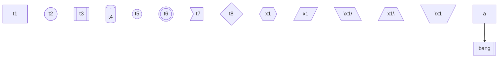
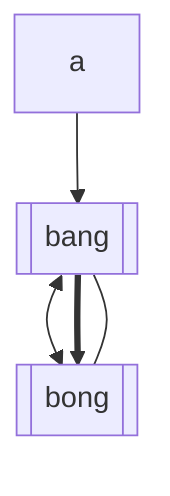

```mermaid
flowchart 

square[t1]
stadium([t2])
subroutine[[t3]]
cylinder[(t4)]
circle((t5))
doublecircle(((t6)))
odd>t7]
diamond{t8}
hexagon{{x1}}
lean_right[/x1/]
lean_left[\\x1\\]
trapezoid[/x1\\]
inv_trapezoid[\\x1/]

a --> b[[bang]]
```

```mermaid
flowchart 

a --> b[[bang]]
b <--> c[[bong]]
b ==> c[[bong]]
b --- c[[bong]]
```