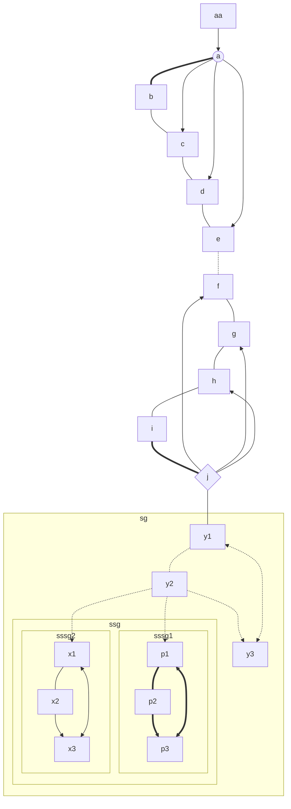

```mermaid
flowchart 
a((a))
j{j}
aa --> a === b --- c --- d --- e -.- f --- g --- h --- i === j

a --> c
a --> d
a --> e
j --> f
j --> g
j --> h

subgraph sg
subgraph ssg
subgraph sssg1
p1 === p2 ==> p3 <==> p1
end
subgraph sssg2
x1 --- x2 --> x3 <--> x1
end
end
y1 -.- y2 -.-> y3 <-.-> y1
end
j --- y1
y2 -.-> p1
y2 -.-> x1
```